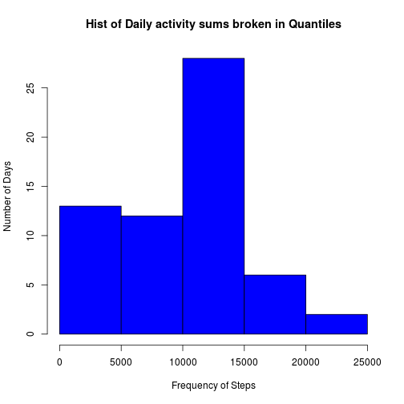
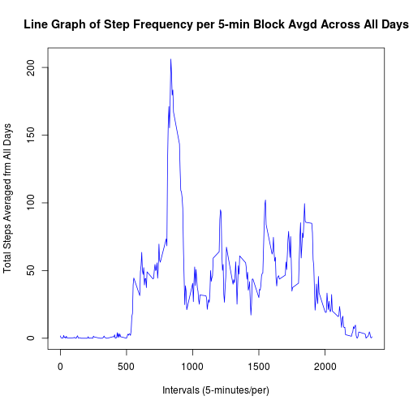
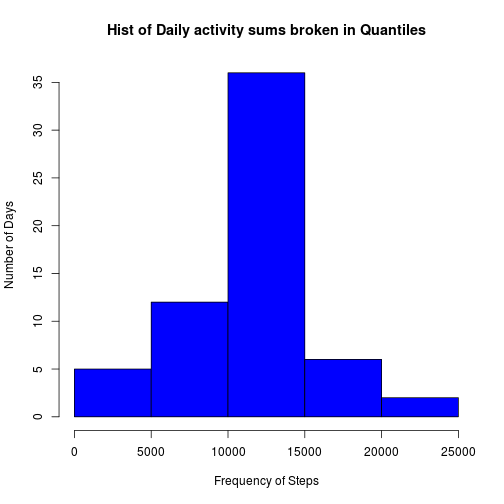
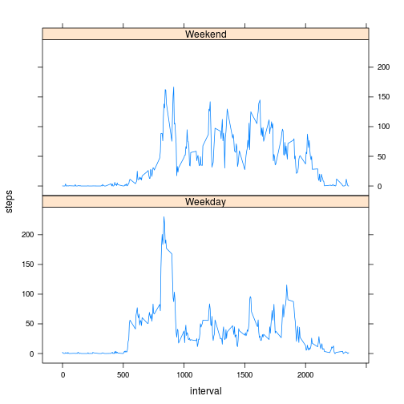

## "Reproducible Research: Peer Assessment 1"

### Loading and preprocessing the data

A file was provided for this Assignment which I proceed to open and analyze per the elements given for consideration in this assignment. 

1. Load the data(i.e. read.csv())

The file contained a dataset of steps taken by a subject, sampled at 5 minute intervals, for a two month span (October and November 2012) of activity.

In processing it, I started out reading activities.csv (the data file) into R studio:


```r
unzip("activity.zip")
fle <- read.csv("activity.csv")
```

checked the head to get a sense of the data,
then proceeded to analysis and questions.

#### What is mean total number of steps taken per day?

This question led to reducing and reshaping the dataset to a workable and more customized set..

Using Reshape2, I reduced the data table to 61 rows each row totaling the steps taken for each calendar day.


```r
library(reshape2)
dmelt <- melt(fle, id = "date", measure.vars = "steps")
SofSteps <- dcast(dmelt, na.rm = T, date ~ variable, sum)
head(SofSteps)
```

```
##         date steps
## 1 2012-10-01     0
## 2 2012-10-02   126
## 3 2012-10-03 11352
## 4 2012-10-04 12116
## 5 2012-10-05 13294
## 6 2012-10-06 15420
```

From that data, I rendered histogram for part 1..

*1) Make a histogram of the total number of steps taken each day*


```r
hist(SofSteps$steps, breaks = 5, ylab = "Number of Days", xlab = "Frequency of Steps", col = "blue", main = "Hist of Daily activity sums broken in Quantiles")
```



*2) Calculate and report the mean and median **total** number of steps taken per day*

I understood this to mean a summary total *per day* as stated as opposed to mean steps per 5 minutes for each day. Therefore, that was easily derived from the reduced dataset above by running 'Summary' on it:


```r
summary(SofSteps)
```

```
##          date        steps      
##  2012-10-01: 1   Min.   :    0  
##  2012-10-02: 1   1st Qu.: 6778  
##  2012-10-03: 1   Median :10395  
##  2012-10-04: 1   Mean   : 9354  
##  2012-10-05: 1   3rd Qu.:12811  
##  2012-10-06: 1   Max.   :21194  
##  (Other)   :55
```

The **mean** of steps in that two month period (Oct-Nov) is *9,354* steps per day. 

The **median** is *10,395* steps/day

After considering daily Average Information, the second part of the assignment seeks to derive if any part of the day's 5 minute intervals stood out consistently to have more walking activity through the sampled days than others;

#### What is the average daily activity pattern?

*1) Make a time series plot (i.e. type = "l") of the 5-minute interval (x-axis) and the average number of steps taken, averaged across all days (y-axis)*

To answer this part I returned to the original data *fle* and used reshape to get the mean of steps taken using *interval* as factor..


```r
fleMelt <- melt(fle, id = "interval", measure.vars = "steps")
fmelted <- dcast(fleMelt, na.rm = T, interval ~ variable, mean)
```

which gave me 288 rows of averages, one for each 5 minutes in a 24 hour period.

I went on to plot this data:


```r
plot(fmelted$interval, fmelted$steps, type = "l", xlab = "Intervals (5-minutes/per)", ylab = "Total Steps Averaged frm All Days", main = "Line Graph of Step Frequency per 5-min Block Avgd Across All Days", col = "blue")
```



There is a clear spike in Average steps taken everyday between about the 800th (5-minute) interval and the 1000th.

Going back to the melted dataFrame *fmelted*, I checked to see at which 5-minute interval this value was (which was also question 2):

*2) Which 5-minute interval, on average across all the days in the dataset, contains the maximum number of steps?*


```r
maximum <- max(fmelted$steps,na.rm = T)
grep(maximum, fmelted$steps)
```

```
## [1] 104
```

As postulated from the graph, the 104th row, giving 206.1698113 steps on average is the 835th (5-minute) interval, or at 8:35am (since **Intervals** Column is based on a 24hour clock with a step 5 increment).

#### Imputing missing values

Revisiting Raw data after basic analytical yield to see if NAs have a significant impact on yield.

*1) Calculate and report the total number of missing values in the dataset (i.e. the total number of rows with NAs)*


```r
nas <- is.na(fle$steps)
naCount <- sum(nas)
```

Out of a total of 17,568 Observations, 2304 are NAs.


*2) Devise a strategy for filling in all of the missing values in the dataset. The strategy does not need to be sophisticated. For example, you could use the mean/median for that day, or the mean for that 5-minute interval, etc.*


To answer this question, I created a quick function to run the same caculations as before and substitue the means of the 5-minute intervals across the days for the other 5-minutes in that time slot that had NA and reconstruct another data frame, as per question 3..

*3) Create a new dataset that is equal to the original dataset but with the missing data filled in.*

..with that data: A substituting the 5-minute mean for missing values in that time slot called subMean.


```r
subMean <- function(fle){
        
        library(reshape2)
        
        fleMelt <- melt(fle, id = "interval", measure.vars = "steps")
        fmelted <- dcast(fleMelt, na.rm = T, interval ~ variable, mean)
        
        for(i in 1:nrow(fle)){
                if(is.na(fle[i,1])){
                        interval <- fle[i,3]
                        fle[i,1] <- fmelted[fmelted$interval == interval, 2]
                        
                }
        }
        
        return(fle)
}

NewFile <- subMean(fle)
```

*4) Make a histogram of the total number of steps taken each day and Calculate and report the mean and median total number of steps taken per day. Do these values differ from the estimates from the first part of the assignment? What is the impact of imputing missing data on the estimates of the total daily number of steps?*

Running the same analysis on this Data as with the original data to see if there is a difference.

I'd made a quick function that integrated the previous task so I ran that:


```r
dfAnalysis <- function(fle){
        
        ## Load Relevant Library
        library(reshape2)
        
        ## item analysis w dmelt
        dmelt <- melt(fle, id = "date", measure.vars = "steps")
        SofSteps <- dcast(dmelt, date ~ variable, sum)
        
        ## Histogram
        hist(SofSteps$steps, breaks = 5, ylab = "Number of Days", xlab = "Frequency of Steps", col = "blue", main = "Hist of Daily activity sums broken in Quantiles")
        
        return(SofSteps)
        
        
}

NewTotal <- dfAnalysis(NewFile)
```



```r
summary(NewTotal)
```

```
##          date        steps      
##  2012-10-01: 1   Min.   :   41  
##  2012-10-02: 1   1st Qu.: 9819  
##  2012-10-03: 1   Median :10766  
##  2012-10-04: 1   Mean   :10766  
##  2012-10-05: 1   3rd Qu.:12811  
##  2012-10-06: 1   Max.   :21194  
##  (Other)   :55
```

The **mean** with the NA values replaced is 10,766 steps per day.

The **median** = 10,766 steps/day


In my first analysis, with Ns removed, the **Mean** was *9,354* steps/day, while **Median** = *10,395* 

In this second part, with NAs replaced it is **Mean** *10,766* **Median** *10,766*.

A difference of almost a thousand steps in the **Mean** but the **Median** stayed relatively the same. And considering the method of rectification (replacing with Means), It would make sense why the Mean would move closer to the Median.

It is hard to say if this difference is significant, but it is worth noting since I did a summary that the first case is closer to the distribution area of the first Quantile in the second case which might encourage further analysis to see its underlying significance.


#### Are there differences in activity patterns between weekdays and weekends?

*1) Create a new factor variable in the dataset with two levels -- "weekday" and "weekend" indicating whether a given date is a weekday or weekend day.*

I wrote a quick funciton to run my NewTotal dataset and return with an added field denoting *'Weekday'* or *'Weekend'* for its respective row. I ran this and ran head for 14 days to check it..


```r
WeekdayField <- function(df){
        
        ## transform date Column to class(date)
        df$date <- as.Date(df$date, format = "%Y-%m-%d")
        
        ## load Relevant library
        library(chron)
        
        dtColumn <- which(colnames(df) == "date")
        daycolumn <- ncol(df) + 1
        
        ## Create Column
        for(i in 1:nrow(df)){
                if(is.weekend(df[i,dtColumn])){
                        df[i,daycolumn] <- "Weekend"
                }else{
                        df[i,daycolumn] <- "Weekday"
                }
                
        }
        
        # Name Column
        names(df)[ncol(df)] <- "Day"
        
        return(df)
        
}

filterF <- function(df){
        
        ## Load Relevant Library
        library(dplyr)
        library(reshape2)
        library(lattice)
        
        
        ## Filter out Weekend and Weekday and do 5-minute analysis of intervals respectively
        wkndSet <- filter(df, Day == "Weekend")
        wkdaySet <- filter(df, Day == "Weekday")
        
        wkdayMelt <- melt(wkdaySet, id = "interval", measure.vars = "steps")
        wkdayMelted <- dcast(wkdayMelt, interval ~ variable, mean)
        wkdayMelted$Day <- "Weekday"
        
        wkndMelt <- melt(wkndSet, id = "interval", measure.vars = "steps")
        wkndMelted <- dcast(wkndMelt, interval ~ variable, mean)
        wkndMelted$Day <- "Weekend"
        
        ## rebind datasets
        FinalData <- rbind(wkdayMelted, wkndMelted)
        
        ## Graph
        FinalData <- transform(FinalData, Day = factor(Day))
        xyplot(steps ~ interval | Day, data = FinalData, type = "l", layout = c(1,2))
        
        
}

NewTotal <- WeekdayField(NewTotal)
head(NewTotal,14)
```

```
##          date    steps     Day
## 1  2012-10-01 10766.19 Weekday
## 2  2012-10-02   126.00 Weekday
## 3  2012-10-03 11352.00 Weekday
## 4  2012-10-04 12116.00 Weekday
## 5  2012-10-05 13294.00 Weekday
## 6  2012-10-06 15420.00 Weekend
## 7  2012-10-07 11015.00 Weekend
## 8  2012-10-08 10766.19 Weekday
## 9  2012-10-09 12811.00 Weekday
## 10 2012-10-10  9900.00 Weekday
## 11 2012-10-11 10304.00 Weekday
## 12 2012-10-12 17382.00 Weekday
## 13 2012-10-13 12426.00 Weekend
## 14 2012-10-14 15098.00 Weekend
```

*2) Make a panel plot containing a time series plot (i.e. type = "l") of the 5-minute interval (x-axis) and the average number of steps taken, averaged across all weekday days or weekend days (y-axis).*

I wrote a function that calculated the intervals per Weekend/Weekday then plotted that from resulting table:


```r
filterF <- function(df){
        
        ## Load Relevant Library
        library(dplyr)
        library(reshape2)
        library(lattice)
        
        
        ## Filter out Weekend and Weekday and do 5-minute analysis of intervals respectively
        wkndSet <- filter(df, Day == "Weekend")
        wkdaySet <- filter(df, Day == "Weekday")
        
        wkdayMelt <- melt(wkdaySet, id = "interval", measure.vars = "steps")
        wkdayMelted <- dcast(wkdayMelt, interval ~ variable, mean)
        wkdayMelted$Day <- "Weekday"
        
        wkndMelt <- melt(wkndSet, id = "interval", measure.vars = "steps")
        wkndMelted <- dcast(wkndMelt, interval ~ variable, mean)
        wkndMelted$Day <- "Weekend"
        
        ## rebind datasets
        FinalData <- rbind(wkdayMelted, wkndMelted)
        
        ## Graph
        FinalData <- transform(FinalData, Day = factor(Day))
        xyplot(steps ~ interval | Day, data = FinalData, type = "l", layout = c(1,2))
        
        
}

EndingSet <- WeekdayField(NewFile)
filterF(EndingSet)
```


